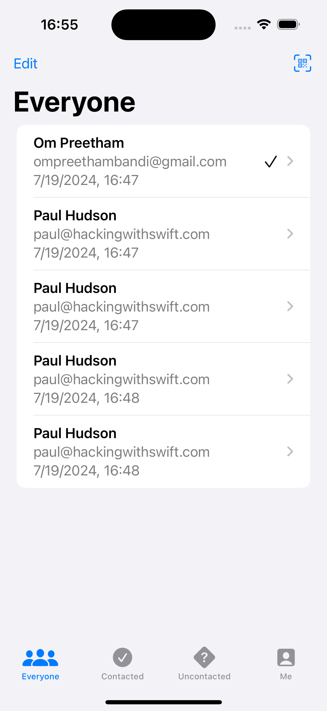
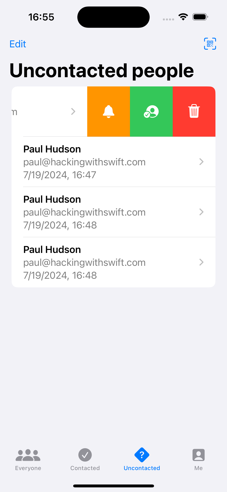

# HotProspects

HotProspects is a SwiftUI application that helps users manage their professional contacts. It provides a user-friendly interface to add new contacts, scan business cards, and manage follow-ups, ensuring you never miss an important connection.

## Features

- **Add Contacts**: Easily add new professional contacts to your list.
- **Scan Business Cards**: Use the camera to scan and automatically add contact information.
- **Follow-Ups**: Set reminders to follow up with important connections.

## Screenshots






## Requirements

- iOS 14.0+
- Xcode 12.0+
- Swift 5.3+

## Installation

1. Clone the repository:
   ```sh
   git clone https://github.com/yourusername/hotprospects.git
   ```
2. Open the project in Xcode:
   ```sh
   cd HotProspects
   open HotProspects.xcodeproj
   ```
3. Build and run the app on your simulator or device.

## License
HotProspects is available under the MIT License. See the [LICENSE](LICENSE) file for more info.
